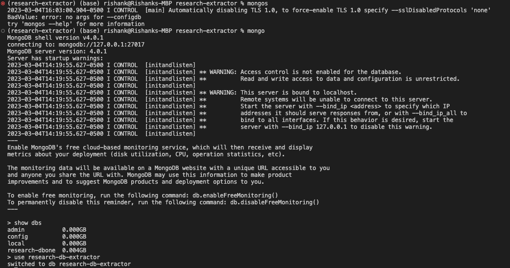
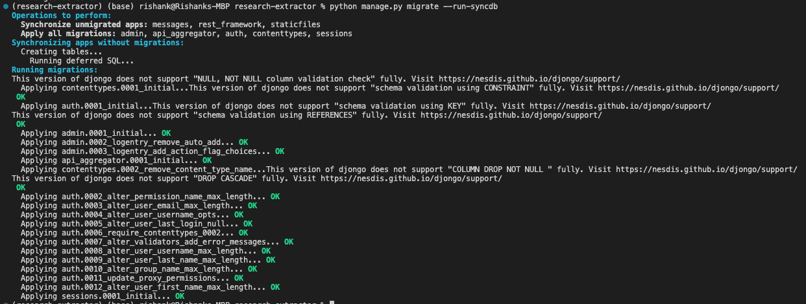
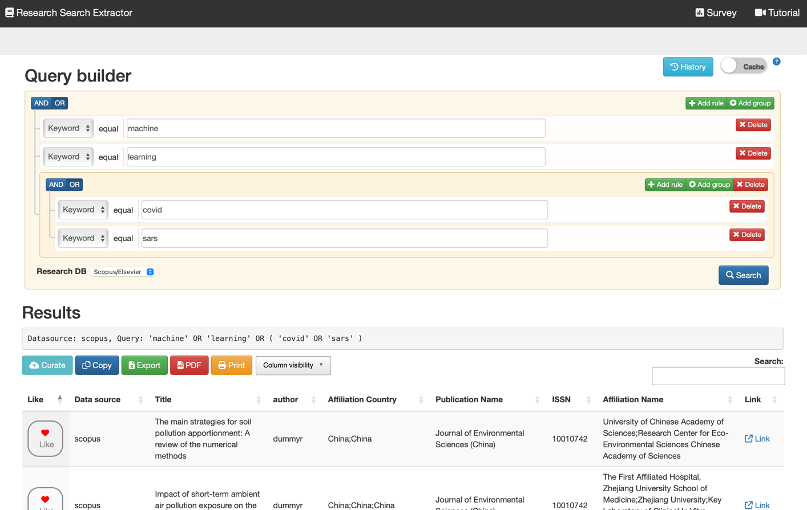
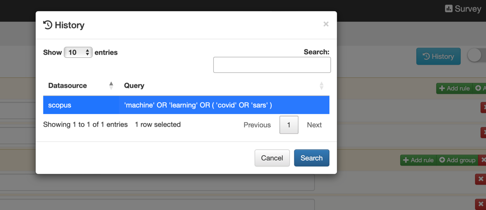
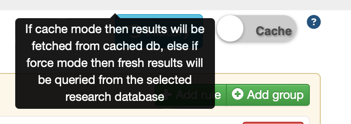
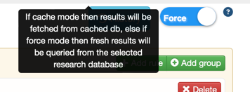

# research-extractor

Prerequisites:
1. Python 3 and above
2. `pipenv`
3. `mongodb`
4. Internet connection & browser: Chrome/Safari/Firefox/Edge
5. API keys for Scientific Research databases like:
   1. Scopus/Elsevier
   2. PubMed
   3. WoS
   4. IEEE


Steps to run the django application:
1. Open a shell to set up mongodb by first starting mongodb server using cmd: `mongod --dbpath <path-for-mongodb>`
2. Open a second shell to connect to mongodb server using cmd: `mongo`
3. Create a database `research-db-extractor`
```agsl
use research-db-extractor
```

2. Install python and pipenv `pip install pipenv`
2. Change directory where manage.py is accessible for example `/Users/rishank/Programming/coursework/fall_2022/info-537/research-extractor`
```agsl
(research-extractor) (base) rishank@Rishanks-MBP research-extractor % ls -ltr
total 184
-rwxr-xr-x   1 rishank  staff    674 Dec  8 18:01 manage.py
-rw-r--r--   1 rishank  staff      0 Dec  8 19:38 db.sqlite3
-rw-r--r--   1 rishank  staff  79586 Dec 18 04:44 Pipfile.lock
drwxr-xr-x  11 rishank  staff    352 Dec 18 04:47 research_extractor
drwxr-xr-x   2 rishank  staff     64 Dec 18 17:44 data
drwxr-xr-x   3 rishank  staff     96 Dec 18 18:45 survey
-rw-r--r--   1 rishank  staff    459 Dec 18 21:45 Pipfile
drwxr-xr-x   5 rishank  staff    160 Mar  4 14:22 logs
-rw-r--r--@  1 rishank  staff     88 Mar  4 15:54 README.md

```
3. Initialize pip env by running `pipenv shell`
4. Create `.env` that will contain API_KEYs for Scopus, PubMed, WoS and IEEE in the format:
```agsl
SCOPUS_API_KEY="<insert_key_here>"
PUBMED_API_KEY="<insert_key_here>"
WOS_API_KEY="<insert_key_here>"
IEEE_API_KEY="<insert_key_here>"
```
8. Switch back to first shell and open file `./research_extractor/settings.py`
9. Search for configuration `DATABASES` and configure the db name as created above in Step 8
```agsl
DATABASES = {
       'default': {
           'ENGINE': 'djongo',
           'NAME': 'research-db-extractor',
       }
   }

```
10. Now we need to set up our django models on mongodb
    1. Create migrations `python manage.py makemigrations`
    2. Migrate models `python manage.py migrate --run-syncdb`
    You'll find the below similar output
    
11. Now run the django application using cmd `python manage.py runserver`, alternatively if you want to change the port due to conflict then append desire port no for example 9090 `python manage.py runserver 9090`
12. Now your application must be up and running, open the link by using localhost and port on which application is running,for example http://localhost:8000 or http://127.0.0.1:8000/
13. Now use the query builder to create your query and select the research db you would like to search and click on search <br>
Note: You can design complex query by click on `Add rule` or `Add group` based on your search boolean logic

14. Curate your desired results by clicking on the like button and to save your curation click on `Curate` button
15. To open previous search results/curations click on `History` button and select the search query and click on search

16. By default, all query results are picked from cache if they're present, however if you would like to refresh then toggle the `Cache` switch
